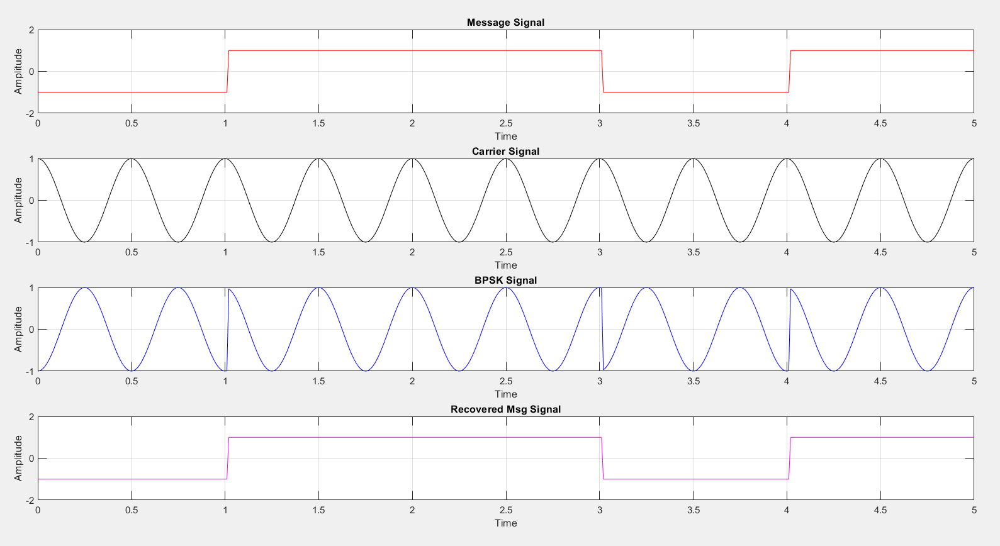

# BPSK Modulation and Demodulation
#### In this matlab program we have modulated NRZ signal to carries and generated BPKS
#### And then we recovered the original message signal
<<<<<<< HEAD

=======

>>>>>>> d2f829feb0289cb73c6e0cc4a3370bd6969704f1
